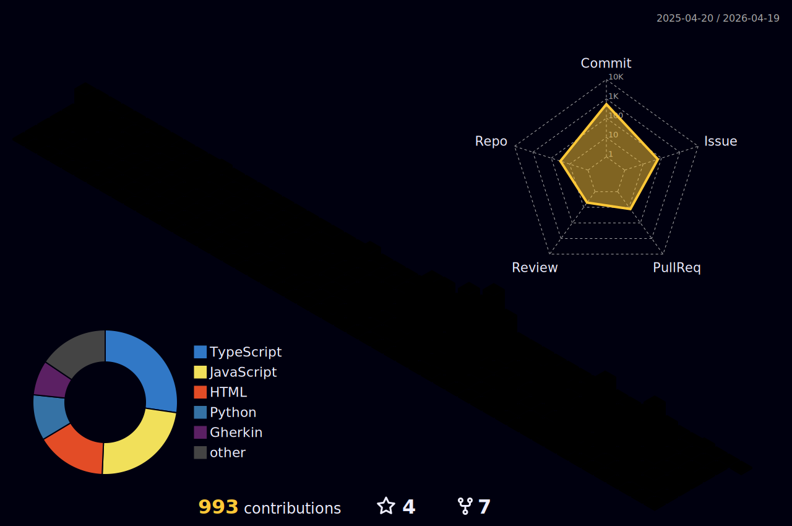

<!-- Animação 3D de Contribuições -->

<!-- Summary Cards -->
|  |  |
| ----------- | ----------- |

## 👋 Sobre mim

Olá! Sou **Rafael Feltrim**, um desenvolvedor de software apaixonado por tecnologia e aprendizado contínuo. Atualmente, atuo como estagiário na **Cadmus Soluções em TI**, focando no desenvolvimento Full Stack com ênfase em backend utilizando Node.js e Express. Tenho experiência com:

- **Frontend**: React.js
- **Backend**: Node.js, Express
- **Automação**: Python
- **APIs**: RESTful
- **Banco de Dados**: MongoDB
- **Outras habilidades**: Web Scraping, Data Analysis

Estou sempre em busca de novos desafios que me permitam aplicar e expandir meus conhecimentos.

---

## 🚀 Tecnologias & Ferramentas

  

---

## 🏆 Conquistas GitHub

  

---

## 📫 Contato

- 📍 São Carlos, São Paulo, Brasil
- 📧 Email: [rafeltrim@gmail.com](mailto:rafeltrim@gmail.com)
- 💼 [LinkedIn](https://www.linkedin.com/in/rafael-feltrim-me/)
- 📸 [Instagram](https://www.instagram.com/rafeltrim/)
