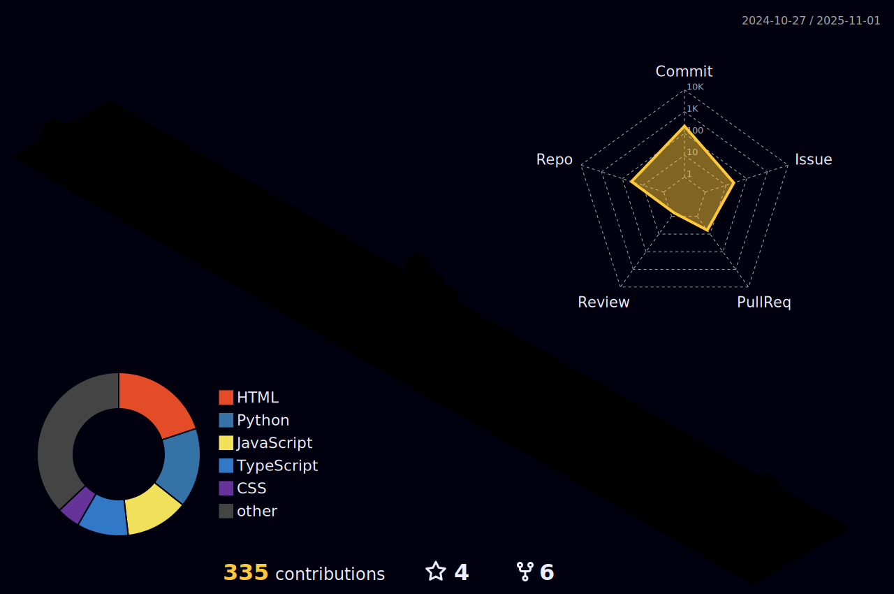

<!-- Animação 3D de Contribuições -->

<!-- Summary Cards -->
|  |  |
| ----------- | ----------- |

<!-- Sobre mim -->
## 👋 Sobre mim

Olá! Meu nome é **Rafael Feltrim**, sou apaixonado por dados, tecnologia e aprendizado contínuo.  
Atualmente estou me desenvolvendo como **Cientista de Dados** e **Engenheiro de Dados**, buscando sempre melhorar minhas habilidades analíticas e técnicas.

- 🎓 Cursando Engenharia de Dados  
- 📊 Interesse em Ciência de Dados, Machine Learning, IA e Engenharia de Dados  
- 🧠 Gosto de resolver problemas complexos com soluções baseadas em dados  
- 💼 Aberto a colaborações em projetos de tecnologia e ciência de dados

---

<!-- Skills Icons -->
## 🚀 Tecnologias & Ferramentas

  

---

<!-- Troféus -->
## 🏆 Conquistas GitHub

  

---

## 📫 Contato

- [LinkedIn](https://www.linkedin.com/in/rafael-feltrim/)  
- Email: **feltrim.rafael@gmail.com**
